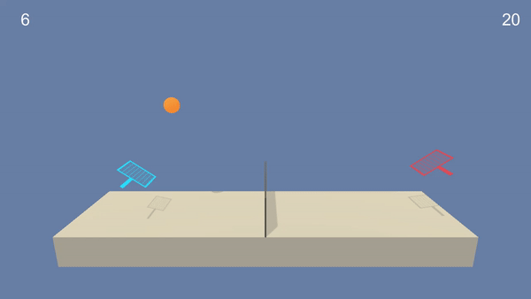
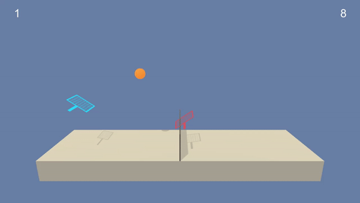
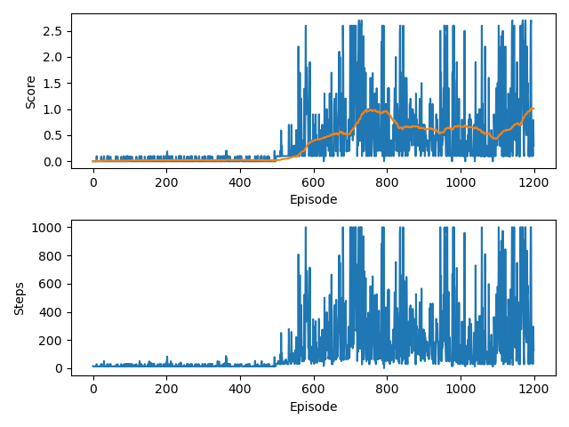

### Training the Agent 

Agents taking random actions:




After successful training, the agents could keep playing all day. Interestingly, the red one seems to be a better player:



We also recorded a couple of minutes of gameplay. To watch these "athletes" in action, follow [this](https://youtu.be/IIOxf7ZQPDE) YouTube link.

Training the agent to required average score of `0.5` took `649` episodes with the `DDPG` implementation. The first 500 steps are just random actions to explore and fill the replay buffer. After `1200` steps, the average score goes up to `1.01`:

### DDPG Algorithm and Network Architecture

We implement a `Deep Deterministic Policy Gradient Policy` algorithm to train the agents. This approach aims to combine the best of `Deep Q Learning` and `Deterministic Policy Gradient` methods and is more conveniently called `DDPG`. The method was first introduced in [this paper](https://arxiv.org/abs/1509.02971), in which the authors successfully solved an array of advanced physics simulation problems in [MuJoCo](http://www.mujoco.org/) environments. The pseudocode of the algorithm can be found on `page 5` of the paper. 

In the paper, an agent has `4` deep neural networks to estimate their policy: 2 for `Actor` and 2 for `Critic`. For this Tennis use case, we implement neural net with `3` hidden layers and rectified linear unit activation functions between the layers for each agent, as follows:  


    Actor(
      (fc1): Linear(in_features=24, out_features=64, bias=True)
      (fc2): Linear(in_features=64, out_features=128, bias=True)
      (fc3): Linear(in_features=128, out_features=2, bias=True)
    )
    Critic(
      (fcs1): Linear(in_features=24, out_features=64, bias=True)
      (fc2): Linear(in_features=66, out_features=128, bias=True)
      (fc3): Linear(in_features=128, out_features=1, bias=True)
    )

Note that for the `Critic`, the `fc2` layer input size is `fcs1_units + action_size` .

For the `Actor`, forward function is forced between  `-1` and `1`. We do this simply by using `tanh` function and this way we can deal with `continuous` action space. Neural net for `Critic` has just linear output .

We train the agents using `shared replay memory`, this way the agents can learn from each others' experiences. 

To force some exploration and to make the training process more stable, we apply a `Uhlenbeck-Ornstein` (stochastic) process to add some `noise` to neural network weights, independently for each agent.

Weights of the trained agent neural network are saved in the `./outputs/` folder in this repository. Use these weights to watch a trained agent interact with the environment.

Parameters used in training process:

```python
# Training Process
self.N_EPISODES = 1200  # max episodes
self.MAX_T = 2000  # max steps per episode

# Agent
self.AGENT_SEED = 0  # random seed for agent
self.BUFFER_SIZE = int(1e6)  # replay buffer size
self.BATCH_SIZE = 512  # minibatch size
self.GAMMA = 0.99  # discount factor
self.TAU = 0.01  # interpolation parameter for soft update of target parameters
self.WEIGHT_DECAY = 0  # L2 weight decay

# Network
self.NN_SEED = 0  # random seed for Pytorch operations / networks
self.LR_ACTOR = 0.003  # learning rate of the actor
self.FC1_UNITS_ACTOR = 64  # size of first hidden layer, actor
self.FC2_UNITS_ACTOR = 128  # size of second hidden layer, actor

self.LR_CRITIC = 0.003  # learning rate of the critic
self.FC1_UNITS_CRITIC = 64  # size of first hidden layer, critic
self.FC2_UNITS_CRITIC = 128  # size of second hidden layer, critic

# Ornstein-Uhlenbeck Process
self.MU = 0.  # average
self.THETA = 0.15  # drift
self.SIGMA = 0.1  # volatility
```

### Ideas for Further Research

In the Udacity discussion forums, someone mentioned that using common weights for Critic neural networks yields more stable training process. That could be a quick win we could try. Further, it's always fun (and sometimes useful) to tweak hyperparameters to try and get better results. Would be interesting to throw other [Unity ML](https://github.com/Unity-Technologies/ml-agents) as well as (continuous) [OpenAI Gym](https://gym.openai.com/) environments at this algorithm and see how it performs.

To further improve this algorithm, we could try prioritised replay buffer introduced in this [paper](https://arxiv.org/abs/1511.05952) and implemented for example in this [repository](https://github.com/ShangtongZhang/DeepRL). 


### Sources:

[Sutton, Richard & Barto, Andrew. Reinforcement Learning: An introduction](http://incompleteideas.net/book/RLbook2018.pdf)

[Continuous control with deep reinforcement learning](https://arxiv.org/abs/1509.02971)

[Benchmarking Deep Reinforcement Learning for Continuous Control](https://arxiv.org/abs/1604.06778)

[Grokking Deep Reinforcement Learning](https://livebook.manning.com/book/grokking-deep-reinforcement-learning)

[Udacity Deep Reinforcement Learning Nanodegree](https://www.udacity.com/course/deep-reinforcement-learning-nanodegree--nd893)

[Udacity Deep Reinforcement Learning Git](https://github.com/udacity/deep-reinforcement-learning)

[My own repository for solving Unity 3d Reacher environment](https://github.com/tomkommando/ReacherProject)


